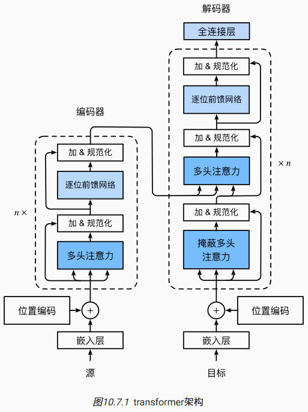

- [Transformer](#transformer)
  - [模型](#模型)
  - [基于位置的前馈网络](#基于位置的前馈网络)
  - [残差连接与层规范化](#残差连接与层规范化)
  - [编码器](#编码器)
    - [多个编码器模块堆叠](#多个编码器模块堆叠)
  - [解码器](#解码器)
    - [多个解码器堆叠](#多个解码器堆叠)
  - [训练](#训练)

# Transformer

- 在比较了CNN,RNN与自注意力，自注意力同时具有**并行计算**和**最短的最大路径长度**这两个优势，因此，使用自注意力来设计深度架构是很有吸引力的
- Transformer模型完全基于注意力机制，没有任何卷积层或循环神经网络层
- 尽管Transformer最初是应用于在文本数据上的序列到序列学习，但现在已经推广到各种现代的深度学习中，例如语言、视觉、语音和强化学习领域

## 模型

1. Transformer的编码器和解码器是基于自注意力的模块叠加而成, 源（输入）序列和目标（输出）序列的嵌入（embedding）表示将加上位置编码（positional encoding），再分别输入到编码器和解码器中



2. Transformer的编码器是由多个相同的层叠加而成的，每个层都有两个子层$sublayer$, 多头注意力汇聚与基于位置的前馈网络(positionwise feed-forward network)
3. 在计算编码器的自注意力时，查询、键和值都来自前一个编码器层的输出
4. 受到残差网络的启发，每个子层都采用了残差连接（residual connection），在残差链接的加法计算完之后紧接着层规范化(layer normalization)
5. 在Transformer中，对于序列中任何位置的任何输入$x 1*d 向量$都要满足$x+sublayer(x) 1*d$
6. 因此，输入序列对应的每个位置，Transformer编码器都将输出一个d维的表示向量

1. Transformer解码器也是由多个相同的层叠加而成的，并且层中使用了残差连接和层规范化
2. 除了编码器中描述的两个子层之外，解码器还在这两个子层之间插入了第三个子层，称为编码器－解码器注意力（encoder-decoder attention）层
3. 在编码器－解码器注意力中，查询Q来自前一个解码器层的输出，而键K和值V来自整个编码器的输出
4. 在解码器自注意力(masked self-attention)中，查询、键和值都来自上一个解码器层的输出, 但是，解码器中的每个位置只能考虑该位置之前的所有位置,这种掩蔽（masked）注意力保留了自回归（auto-regressive）属性，确保预测仅依赖于已生成的输出词元

## 基于位置的前馈网络

嗯...是一个MLP

## 残差连接与层规范化

1. [批量规范化](../../ch7_现代cnn/batch_norm_4.py)在一个小批量的样本内进行均值为0，方差为1的变换，然后重新缩放与偏移
2. 层规范化是基于特征维度进行规范化，目标也是进行均值为0，方差为1的变换，然后重新缩放与偏移
3. 批量规范化在计算机视觉中被广泛应用，但在自然语言处理任务中（输入通常是变长序列）批量规范化通常不如层规范化的效果好

```python
ln = nn.LayerNorm(2)
bn = nn.BatchNorm1d(2)
X = torch.tensor([[1, 2], [2, 3]], dtype=torch.float32)
# 在训练模式下计算X的均值和方差
print('layer norm:', ln(X), '\nbatch norm:', bn(X))
```

```
layer norm: tensor([[-1.0000,  1.0000],
        [-1.0000,  1.0000]], grad_fn=<NativeLayerNormBackward0>)

# [(1-1.5)/0.5, (2-2.5)/0.5]
# [(2-1.5)/0.5, (3-2.5)/0.5]
batch norm: tensor([[-1.0000, -1.0000],
        [ 1.0000,  1.0000]], grad_fn=<NativeBatchNormBackward0>)
```

1. 可以使用残差连接和层规范化来实现AddNorm类, 暂退法也被作为正则化方法使用
2. 残差连接要求两个输入的形状相同，以便加法操作后输出张量的形状相同

```python
#@save
class AddNorm(nn.Module):
    """残差连接后进行层规范化"""
    def __init__(self, normalized_shape, dropout, **kwargs):
        super(AddNorm, self).__init__(**kwargs)
        self.dropout = nn.Dropout(dropout)
        self.ln = nn.LayerNorm(normalized_shape)

    def forward(self, X, Y):
        return self.ln(self.dropout(Y) + X)
```

## 编码器

有了组成Transformer编码器的基础组件，现在可以先实现编码器中的一个层

下面的EncoderBlock类包含两个子层：多头自注意力和基于位置的前馈网络，这两个子层都使用了残差连接和紧随的层规范化

Transformer编码器中的任何层都不会改变其输入的形状

```python
#@save
class EncoderBlock(nn.Module):
    """Transformer编码器块"""
    def __init__(self, key_size, query_size, value_size, num_hiddens,
                 norm_shape, ffn_num_input, ffn_num_hiddens, num_heads,
                 dropout, use_bias=False, **kwargs):
        super(EncoderBlock, self).__init__(**kwargs)
        # 多头注意力
        self.attention = d2l.MultiHeadAttention(
            key_size, query_size, value_size, num_hiddens, num_heads, dropout,
            use_bias)
        # 残差连接与层规范化
        self.addnorm1 = AddNorm(norm_shape, dropout)
        # 基于位置的前馈网络
        self.ffn = PositionWiseFFN(
            ffn_num_input, ffn_num_hiddens, num_hiddens)
        # 残差连接与层规范化
        self.addnorm2 = AddNorm(norm_shape, dropout)

    def forward(self, X, valid_lens):
        Y = self.addnorm1(X, self.attention(X, X, X, valid_lens))
        return self.addnorm2(Y, self.ffn(Y))
```

### 多个编码器模块堆叠

```python
#@save
class TransformerEncoder(d2l.Encoder):
    """Transformer编码器"""
    def __init__(self, vocab_size, key_size, query_size, value_size,
                 num_hiddens, norm_shape, ffn_num_input, ffn_num_hiddens,
                 num_heads, num_layers, dropout, use_bias=False, **kwargs):
        super(TransformerEncoder, self).__init__(**kwargs)
        self.num_hiddens = num_hiddens
        self.embedding = nn.Embedding(vocab_size, num_hiddens) # 词嵌入层
        self.pos_encoding = d2l.PositionalEncoding(num_hiddens, dropout) # 位置编码
        self.blks = nn.Sequential() # 用Sequential列表存放多个编码器块
        for i in range(num_layers):
            self.blks.add_module("block"+str(i),
                EncoderBlock(key_size, query_size, value_size, num_hiddens,
                             norm_shape, ffn_num_input, ffn_num_hiddens,
                             num_heads, dropout, use_bias))

    def forward(self, X, valid_lens, *args):
        # 因为位置编码值在-1和1之间，
        # 因此嵌入值乘以嵌入维度的平方根进行缩放
        # 然后再与位置编码相加
        X = self.pos_encoding(self.embedding(X) * math.sqrt(self.num_hiddens)) # 嵌入向量乘以维度的平方根进行缩放
        self.attention_weights = [None] * len(self.blks)
        for i, blk in enumerate(self.blks):
            # 将输入传给编码器，每一层输出作为下一层的输入，valid_lens 用于处理变长序列，屏蔽无效位置
            X = blk(X, valid_lens)
            # 从当前层提取注意力权重并存储到对应位置，作为权重记录
            self.attention_weights[i] = blk.attention.attention.attention_weights
        return X
```

## 解码器

Transformer解码器也是由多个相同的层组成，在DecoderBlock类中实现的每个层包含了三个子层：解码器掩蔽多头自注意力、“编码器-解码器”注意力和基于位置的前馈网络，每个子层结束后也都要进行残差连接与层规范化

1. 在掩蔽多头解码器自注意力层（第一个子层）中，查询Q，键K，值V都来自上一个解码器层的输出
2. 在任何解码器时间步中，只有生成的词元才能用于解码器的自注意力计算中
3. 为了在解码器中保留自回归的属性，其掩蔽自注意力设定了参数dec_valid_lens，以便任何查询都只会与解码器中所有已经生成词元的位置（即直到该查询位置为止）进行注意力计算

关于序列到序列模型（sequence-to-sequence model），在训练阶段，其输出序列的所有位置（时间步）的词元都是已知的；然而，在预测阶段，其输出序列的词元是逐个生成的

```python
class DecoderBlock(nn.Module):
    """解码器中第i个块"""
    def __init__(self, key_size, query_size, value_size, num_hiddens,
                 norm_shape, ffn_num_input, ffn_num_hiddens, num_heads,
                 dropout, i, **kwargs):
        super(DecoderBlock, self).__init__(**kwargs)
        self.i = i
        self.attention1 = d2l.MultiHeadAttention(
            key_size, query_size, value_size, num_hiddens, num_heads, dropout) # 掩码多头注意力（解码器自注意力）
        self.addnorm1 = AddNorm(norm_shape, dropout) # 残差连接与层规范化，为attention1搭配
        self.attention2 = d2l.MultiHeadAttention(
            key_size, query_size, value_size, num_hiddens, num_heads, dropout) # 编码器-解码器注意力
        self.addnorm2 = AddNorm(norm_shape, dropout) # 残差连接与层规范化，为attention2搭配
        self.ffn = PositionWiseFFN(ffn_num_input, ffn_num_hiddens,
                                   num_hiddens) # 基于位置的前馈网络
        self.addnorm3 = AddNorm(norm_shape, dropout) # 残差连接与层规范化，为ffn搭配

    def forward(self, X, state):
        # state[0]: 编码器的输出表示
        # state[1]: 编码器的有效长度（用于处理变长序列）
        # state[2]: 解码器各层的历史状态缓存
        enc_outputs, enc_valid_lens = state[0], state[1]

        # 训练阶段，输出序列的所有词元都在同一时间处理，
        # 因此state[2][self.i]初始化为None
        # 预测阶段，输出序列是通过词元一个接着一个解码的，
        # 因此state[2][self.i]包含着直到当前时间步第i个块解码的输出表示
        if state[2][self.i] is None:
            key_values = X
        else:
            # 将历史输出state[2][self.i]与当前输入X拼接成键值对
            key_values = torch.cat((state[2][self.i], X), axis=1)
        state[2][self.i] = key_values

        if self.training: # 训练阶段
            batch_size, num_steps, _ = X.shape
            # dec_valid_lens的开头:(batch_size,num_steps),
            # 其中每一行是[1,2,...,num_steps]
            dec_valid_lens = torch.arange(
                1, num_steps + 1, device=X.device).repeat(batch_size, 1)
            # 对于长度为 n 的序列，第 i 个位置只能看到前 i 个位置
            # 例如：对于 4 个时间步，dec_valid_lens 为 [1, 2, 3, 4]
        else:
            dec_valid_lens = None

        # 掩码多头注意力
        X2 = self.attention1(X, key_values, key_values, dec_valid_lens)
        Y = self.addnorm1(X, X2)
        # 编码器－解码器注意力
        # enc_outputs的开头:(batch_size,num_steps,num_hiddens)
        Y2 = self.attention2(Y, enc_outputs, enc_outputs, enc_valid_lens)
        Z = self.addnorm2(Y, Y2)

        # 基于位置的前馈网络
        return self.addnorm3(Z, self.ffn(Z)), state
```

### 多个解码器堆叠

构建由num_layers个DecoderBlock实例组成的完整的Transformer解码器

最后，通过一个全连接层计算所有vocab_size个可能的输出词元的预测值, 解码器的自注意力权重和编码器解码器注意力权重都被存储下来，方便日后可视化的需要

```python
class TransformerDecoder(d2l.AttentionDecoder):
    def __init__(self, vocab_size, key_size, query_size, value_size,
                 num_hiddens, norm_shape, ffn_num_input, ffn_num_hiddens,
                 num_heads, num_layers, dropout, **kwargs):
        super(TransformerDecoder, self).__init__(**kwargs)
        self.num_hiddens = num_hiddens
        self.num_layers = num_layers
        self.embedding = nn.Embedding(vocab_size, num_hiddens) # 词嵌入层
        self.pos_encoding = d2l.PositionalEncoding(num_hiddens, dropout) # 位置编码
        self.blks = nn.Sequential() # 解码器堆叠
        for i in range(num_layers):
            self.blks.add_module("block"+str(i),
                DecoderBlock(key_size, query_size, value_size, num_hiddens,
                             norm_shape, ffn_num_input, ffn_num_hiddens,
                             num_heads, dropout, i))
        self.dense = nn.Linear(num_hiddens, vocab_size) # 输出前的全连接层

    def init_state(self, enc_outputs, enc_valid_lens, *args):
        '''
        enc_outputs：编码器输出
        enc_valid_lens：编码器有效长度，处理变长序列
        '''
        # [None] * self.num_layers 解码器各层的历史状态缓存
        return [enc_outputs, enc_valid_lens, [None] * self.num_layers]

    def forward(self, X, state):
        # 对输入进行词嵌入与位置编码
        X = self.pos_encoding(self.embedding(X) * math.sqrt(self.num_hiddens))

        # 收集 解码器自注意力权重 与 编码器-解码器注意力权重
        self._attention_weights = [[None] * len(self.blks) for _ in range (2)]
        # 通过多个解码器处理输入
        for i, blk in enumerate(self.blks):
            X, state = blk(X, state)
            # 解码器自注意力权重
            self._attention_weights[0][
                i] = blk.attention1.attention.attention_weights
            # 编码器－解码器 自注意力权重
            self._attention_weights[1][
                i] = blk.attention2.attention.attention_weights

        # 通过线性层映射到词汇表空间
        return self.dense(X), state

    @property
    def attention_weights(self):
        '''
        注意力权重访问
        '''
        # 对解码过程中产生的注意力权重的访问
        return self._attention_weights
```

## 训练

依照Transformer架构来实例化编码器－解码器模型。在这里，指定Transformer的编码器和解码器都是2层，都使用4头注意力

为了进行序列到序列的学习，下面在“英语－法语”机器翻译数据集上训练Transformer模型

```python
# num_hiddens：隐藏层维度
# num_layers：编码器，解码器的堆叠层数
# batch_size：每个批次包含64个样本
# num_steps：序列最大长度为10个token
num_hiddens, num_layers, dropout, batch_size, num_steps = 32, 2, 0.1, 64, 10
lr, num_epochs, device = 0.005, 200, d2l.try_gpu() # 学习率，训练轮数200，设备
# ffn_num_input：前馈网络的输入维度
# ffn_num_hiddens：前馈网络隐藏层维度
# num_heads：注意力头数
ffn_num_input, ffn_num_hiddens, num_heads = 32, 64, 4

# 注意力机制中Q、K、V的维度均为32
key_size, query_size, value_size = 32, 32, 32
# LayerNorm的归一化维度
norm_shape = [32]

# 加载英语-法语机器翻译数据集，创建训练迭代器与词汇表
train_iter, src_vocab, tgt_vocab = d2l.load_data_nmt(batch_size, num_steps)

# 编码器实例化
encoder = TransformerEncoder(
    len(src_vocab), key_size, query_size, value_size, num_hiddens,
    norm_shape, ffn_num_input, ffn_num_hiddens, num_heads,
    num_layers, dropout)

# 解码器实例化
decoder = TransformerDecoder(
    len(tgt_vocab), key_size, query_size, value_size, num_hiddens,
    norm_shape, ffn_num_input, ffn_num_hiddens, num_heads,
    num_layers, dropout)

# 组合编码器-解码器模型
net = d2l.EncoderDecoder(encoder, decoder)

# 开始训练
d2l.train_seq2seq(net, train_iter, lr, num_epochs, tgt_vocab, device)
```
