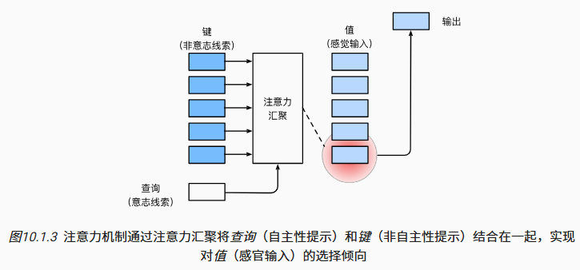

基于非自主性提示和自主性提示 有选择地引导注意力的焦点

1. 非自主性提示是基于环境中物体的突出性和易见性
2. 自主性提示依赖于意识，

## 查询、键、值

首先，考虑一个相对简单的状况，即只使用非自主性提示。 要想将选择偏向于感官输入， 则可以简单地使用参数化的全连接层， 甚至是非参数化的最大汇聚层或平均汇聚层

`卷积、全连接层、汇聚层通常只考虑不随意线索，因为它们都暴力地将所有数据都直接输入到神经网络中，而不对目标加以区分`

因此，“是否包含自主性提示”将注意力机制与全连接层或汇聚层区别开来

1. 在注意力机制的背景下，自主性提示被称为查询（query）
   1.  给定任何查询，注意力机制通过注意力汇聚（attention pooling） 将选择引导至感官输入（sensory inputs，例如中间特征表示）
2.  在注意力机制中，这些感官输入被称为值（value）
3.  每个值都与一个键key配对，这些key可以想象成非自主提示
4.  可以通过设计注意力汇聚的方式， 便于给定的查询（自主性提示）与键（非自主性提示）进行匹配， 这将引导得出最匹配的值（感官输入）

注意力机制通过注意力汇聚将查询（自主性提示）和键（非自主性提示）结合在一起，实现对值（感官输入）的选择倾向，这就是与 CNN 等模型的关键区别
