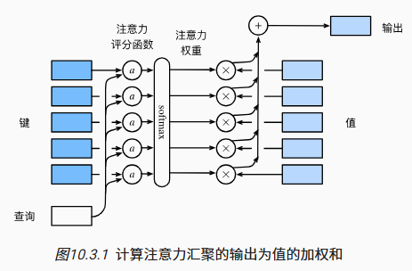
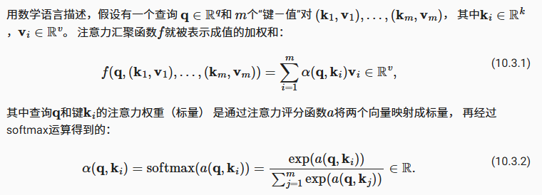
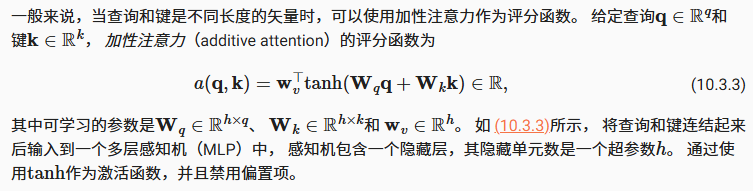
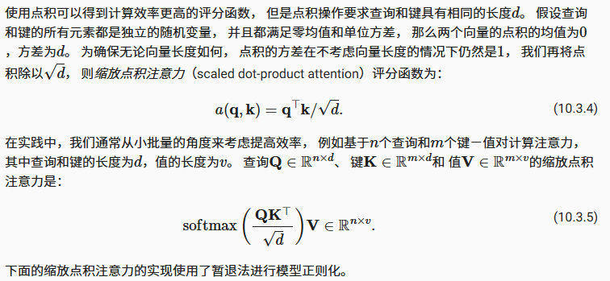

- [注意力评分函数](#注意力评分函数)
  - [掩蔽softmax操作](#掩蔽softmax操作)
  - [加性注意力](#加性注意力)
  - [缩放点积注意力](#缩放点积注意力)

1. 将注意力汇聚的输出计算可以作为值的加权平均，选择不同的注意力评分函数会带来不同的注意力汇聚操作
2. 当查询和键是不同长度的矢量时，可以使用可加性注意力评分函数。当它们的长度相同时，使用缩放的“点－积”注意力评分函数的计算效率更高

# 注意力评分函数

nadaraya-watson使用了高斯核来对查询Q和键K之间的关系建模，高斯核指数部分可以视为注意力评分函数（attention scoring function）， 简称评分函数（scoring function）， 然后把这个函数的输出结果输入到softmax函数中进行运算

通过上述步骤，将得到与键对应的值的概率分布（即注意力权重）。 最后，注意力汇聚的输出就是基于这些注意力权重的值的加权和

$\alpha 表示注意力评价函数$，由于注意力权重是概率分布， 因此加权和其本质上是加权平均值

正如上图所示，选择不同的注意力评分函数$\alpha$会导致不同的注意力汇聚操作

## 掩蔽softmax操作

softmax操作用于输出一个概率分布作为注意力权重, 可以指定一个有效序列长度，以便在计算softmax时过滤掉超出指定范围的位置

## 加性注意力

当查询Q和键K是不同长度的矢量时，可以使用加性注意力作为评分函数

## 缩放点积注意力

使用点积可以得到计算效率更高的评分函数， 但是点积操作要求查询和键具有相同的长度d

