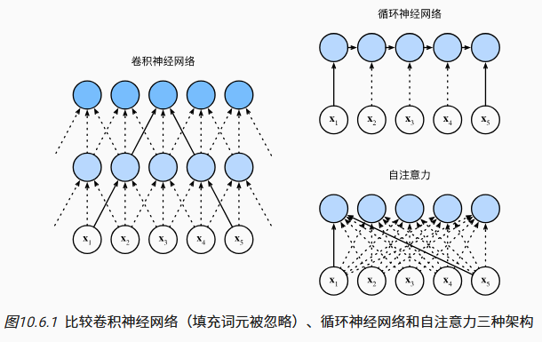

- [自注意力与位置编码](#自注意力与位置编码)
  - [自注意力](#自注意力)
  - [比较CNN RNN 和自注意力](#比较cnn-rnn-和自注意力)
  - [位置编码](#位置编码)
    - [绝对位置信息](#绝对位置信息)
    - [相对位置信息](#相对位置信息)
  - [总结](#总结)

# 自注意力与位置编码

在深度学习中，经常使用卷积神经网络（CNN）或循环神经网络（RNN）对序列进行编码，有了注意力机制之后，我们将词元序列输入注意力池化中， 以便同一组词元同时充当查询Q、键K和值V

1. 具体来说，每个查询都会关注所有的键－值对并生成一个注意力输出
2. 由于查询、键和值来自同一组输入，因此被称为 自注意力（self-attention）或内部注意力（internal attention）

## 自注意力

## 比较CNN RNN 和自注意力

接下来比较下面几个架构，目标都是将由n个词元组成的序列映射到另一个长度相等的序列，其中的每个输入词元或输出词元都由d维向量表示

比较的是卷积神经网络、循环神经网络和自注意力这几个架构的计算复杂性、顺序操作和最大路径长度

考虑一个卷积核大小为k的卷积层，序列长度为n,输入，输出通道数量为d,所以卷积层的计算复杂度为(k * d * d)卷积神经网络是分层的，因此为有O(1)的顺序操作，最大路径长度为O(n/k),如上图x1,x5处于卷积核大小为3的双层卷积神经网络的感受野内

在自注意力中，每个词元都可以通过自注意力机制与所有其他词元进行交互

卷积神经网络和自注意力都拥有并行计算的优势， 而且自注意力的最大路径长度最短。 但是因为其计算复杂度是关于序列长度的二次方，所以在很长的序列中计算会非常慢

## 位置编码

1. 在处理词元序列时，循环神经网络是逐个的重复地处理词元的， 而自注意力则因为并行计算而放弃了顺序操作
2. 为了使用序列的顺序信息，通过在输入表示中添加 位置编码（positional encoding）来注入绝对的或相对的位置信息
3. 位置编码可以通过学习得到也可以直接固定得到。 接下来描述的是基于正弦函数和余弦函数的固定位置编码

### 绝对位置信息

### 相对位置信息

除了捕获绝对位置信息之外，上述的位置编码还允许模型学习得到输入序列中相对位置信息

## 总结

1. 在自注意力中，查询、键和值都来自同一组输入
2. 卷积神经网络和自注意力都拥有并行计算的优势，而且自注意力的最大路径长度最短。但是因为其计算复杂度是关于序列长度的二次方，所以在很长的序列中计算会非常慢
3. 为了使用序列的顺序信息，可以通过在输入表示中添加位置编码，来注入绝对的或相对的位置信息
