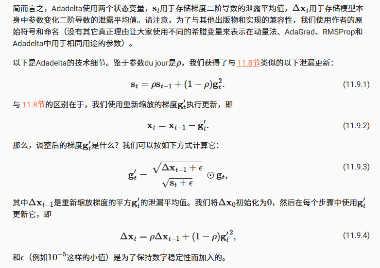

- [Adadelta算法](#adadelta算法)
- [小结](#小结)

## Adadelta算法

Adadelta自适应学习率算法，是AdaGrad的另一种变体



```python
import torch
from d2l import torch as d2l


def init_adadelta_states(feature_dim):
    # 梯度累计与更新累计
    s_w, s_b = torch.zeros((feature_dim, 1)), torch.zeros(1) # 梯度平方的指数移动平均值
    delta_w, delta_b = torch.zeros((feature_dim, 1)), torch.zeros(1) # 参数更新的累计
    return ((s_w, delta_w), (s_b, delta_b))

def adadelta(params, states, hyperparams):
    rho, eps = hyperparams['rho'], 1e-5
    for p, (s, delta) in zip(params, states):
        with torch.no_grad():
            # 更新梯度平方的指数移动平均
            s[:] = rho * s + (1 - rho) * torch.square(p.grad)
            # 计算有效梯度，这里做了自适应学习率计算
            # effective_lr = sqrt(Δ + ε) / sqrt(s + ε)
            g = (torch.sqrt(delta + eps) / torch.sqrt(s + eps)) * p.grad
            # 更新参数
            p[:] -= g
            # 更新参数更新平方
            delta[:] = rho * delta + (1 - rho) * g * g
        p.grad.data.zero_()
```

每次参数更新，$\rho=0.9$对应10个半衰期

```python
data_iter, feature_dim = d2l.get_data_ch11(batch_size=10)
d2l.train_ch11(adadelta, init_adadelta_states(feature_dim),
               {'rho': 0.9}, data_iter, feature_dim);
```

简洁实现

```python
trainer = torch.optim.Adadelta
d2l.train_concise_ch11(trainer, {'rho': 0.9}, data_iter)
```

## 小结

- `Adadelta`没有学习率参数。相反，它使用参数本身的变化率来调整学习率
- `Adadelta`需要两个状态变量来存储梯度的二阶导数和参数的变化
- `Adadelta`使用泄漏的平均值来保持对适当统计数据的运行估计
