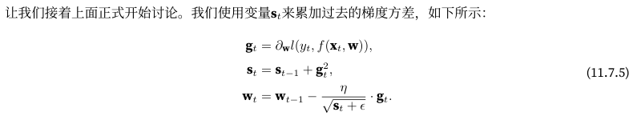

## Adagrad算法

- AdaGrad算法使用一种方式来表示黑塞矩阵（Hessian）的对角线
- AdaGrad算法是一种随机梯度下降算法，我们可以放心地使用梯度的方差作为黑塞矩阵比例的廉价替代



在AdaGrad算法中，我们允许每个坐标有单独的学习率。与SGD算法相比，这并没有明显增加AdaGrad的计算代价，因为主要计算用在计算梯度标准差

```python
%matplotlib inline
import math
import torch
from d2l import torch as d2l

def adagrad_2d(x1, x2, s1, s2):
    eps = 1e-6
    g1, g2 = 0.2 * x1, 4 * x2
    s1 += g1 ** 2
    s2 += g2 ** 2
    x1 -= eta / math.sqrt(s1 + eps) * g1
    x2 -= eta / math.sqrt(s2 + eps) * g2
    return x1, x2, s1, s2

def f_2d(x1, x2):
    return 0.1 * x1 ** 2 + 2 * x2 ** 2

eta = 0.4 # 学习率
d2l.show_trace_2d(f_2d, d2l.train_2d(adagrad_2d))
```

可以看到，自变量的迭代轨迹较平滑。 但由于$s_t$的累加效果使学习率不断衰减，自变量在迭代后期的移动幅度较小，将学习率提高到2可以看到更好表现，这已经表明，即使在无噪声的情况下，学习率的降低可能相当剧烈，我们需要确保参数能够适当地收敛

## 从零开始实现

```python
def init_adagrad_states(feature_dim):
    s_w = torch.zeros((feature_dim, 1))
    s_b = torch.zeros(1)
    return (s_w, s_b)

def adagrad(params, states, hyperparams):
    eps = 1e-6
    for p, s in zip(params, states):
        with torch.no_grad():
            s[:] += torch.square(p.grad)
            p[:] -= hyperparams['lr'] * p.grad / torch.sqrt(s + eps)
        p.grad.data.zero_()


# 使用更大的学习率来训练
data_iter, feature_dim = d2l.get_data_ch11(batch_size=10)
d2l.train_ch11(adagrad, init_adagrad_states(feature_dim),
               {'lr': 0.1}, data_iter, feature_dim);

```

## 简洁实现

```python
trainer = torch.optim.Adagrad
d2l.train_concise_ch11(trainer, {'lr': 0.1}, data_iter)
```

## 小结

- AdaGrad算法会在单个坐标层面动态降低学习率
- AdaGrad算法利用梯度的大小作为调整进度速率的手段：用较小的学习率来补偿带有较大梯度的坐标
- 在深度学习问题中，由于内存和计算限制，计算准确的二阶导数通常是不可行的。梯度可以作为一个有效的代理
- 如果优化问题的结构相当不均匀，AdaGrad算法可以帮助缓解扭曲
- AdaGrad算法对于稀疏特征特别有效，在此情况下由于不常出现的问题，学习率需要更慢地降低
- 在深度学习问题上，AdaGrad算法有时在降低学习率方面可能过于剧烈，需要改善
