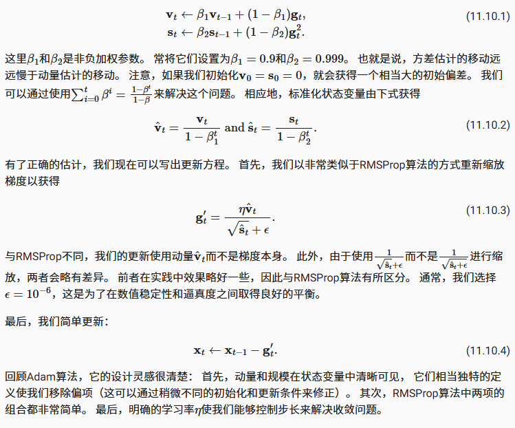
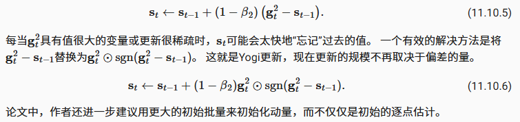

- [Adam算法](#adam算法)
  - [算法内容](#算法内容)
  - [实现](#实现)
  - [yogi](#yogi)
  - [小结](#小结)

## Adam算法

简短回顾之前的优化算法

- 随机梯度下降在解决优化问题时比梯度下降更有效
- 在一个小批量中使用更大的观测值集，可以通过向量化提供额外效率。这是高效的多机、多GPU和整体并行处理的关键
- 动量法提供一种机制，汇总过去历史中的梯度信息，加速收敛
- AdaGrad通过对每个坐标缩放来实现高效计算的预处理器
- RMSprop通过学习率的调整来分离每个坐标的缩放

Adam算法将所有这些技术汇总到一个高效的学习算法中，它非常受欢迎。 但是它并非没有问题。有时Adam算法可能由于方差控制不良而发散，在完善工作中提供了一个yogi的热补丁进行解决

### 算法内容

Adam算法的关键组成部分之一是：它使用指数加权移动平均值来估算梯度的动量和二次矩，即使用状态变量



### 实现

```python
import torch
from d2l import torch as d2l


def init_adam_states(feature_dim):
    v_w, v_b = torch.zeros((feature_dim, 1)), torch.zeros(1)
    s_w, s_b = torch.zeros((feature_dim, 1)), torch.zeros(1)
    return ((v_w, s_w), (v_b, s_b))

def adam(params, states, hyperparams):
    beta1, beta2, eps = 0.9, 0.999, 1e-6
    for p, (v, s) in zip(params, states):
        with torch.no_grad():
            v[:] = beta1 * v + (1 - beta1) * p.grad # 动量
            s[:] = beta2 * s + (1 - beta2) * torch.square(p.grad) # 二阶矩
            v_bias_corr = v / (1 - beta1 ** hyperparams['t'])
            s_bias_corr = s / (1 - beta2 ** hyperparams['t'])

            # 重新缩放梯度
            p[:] -= hyperparams['lr'] * v_bias_corr / (torch.sqrt(s_bias_corr)
                                                       + eps)
        p.grad.data.zero_()
    hyperparams['t'] += 1
```

用以上Adam算法来训练模型，这里我们使用$\eta=0.01$的学习率

```python
data_iter, feature_dim = d2l.get_data_ch11(batch_size=10)
d2l.train_ch11(adam, init_adam_states(feature_dim),
               {'lr': 0.01, 't': 1}, data_iter, feature_dim);
```

### yogi

Adam算法也存在一些问题： 即使在凸环境下，当$s_t$的方差(二阶矩)估计不断增加时，他可能无法收敛，Yogi算法通过使用一个不同的方差估计来修正Adam算法，从而解决这个问题



```python
def yogi(params, states, hyperparams):
    beta1, beta2, eps = 0.9, 0.999, 1e-3
    for p, (v, s) in zip(params, states):
        with torch.no_grad():
            v[:] = beta1 * v + (1 - beta1) * p.grad
            s[:] = s + (1 - beta2) * torch.sign(
                torch.square(p.grad) - s) * torch.square(p.grad)
            v_bias_corr = v / (1 - beta1 ** hyperparams['t'])
            s_bias_corr = s / (1 - beta2 ** hyperparams['t'])
            p[:] -= hyperparams['lr'] * v_bias_corr / (torch.sqrt(s_bias_corr)
                                                       + eps)
        p.grad.data.zero_()
    hyperparams['t'] += 1

data_iter, feature_dim = d2l.get_data_ch11(batch_size=10)
d2l.train_ch11(yogi, init_adam_states(feature_dim),
               {'lr': 0.01, 't': 1}, data_iter, feature_dim);
```

### 小结

- Adam算法将许多优化算法的功能结合到了相当强大的更新规则中
- Adam算法在RMSProp算法基础上创建的，还在小批量的随机梯度上使用EWMA
- 在估计动量和二次矩时，Adam算法使用偏差校正来调整缓慢的启动速度
- 对于具有显著差异的梯度，我们可能会遇到收敛性问题。我们可以通过使用更大的小批量或者切换到改进的估计值$s_t$来修正它们。Yogi提供了这样的替代方案
