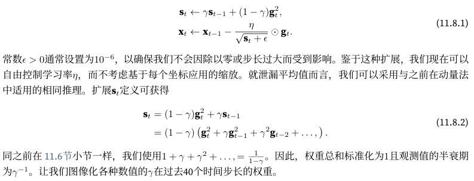
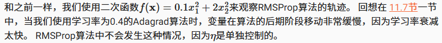

- [RMSProp优化算法](#rmsprop优化算法)
  - [从零开始实现](#从零开始实现)
  - [简洁实现](#简洁实现)
- [小结](#小结)

## RMSProp优化算法

adagrad算法是将梯度的平方累加成状态量，由于缺乏规范化，没有约束，$s_t$持续增长，在收敛过程中呈线性递增

解决这个问题的一种方法是使用$s_t/t$,但是生效需要较长时间。另一种方法是使用动量法中的泄露平均值$s_t \leftarrow \gamma s_{t-1} + (1-\gamma)g^2_t$，保持其他不变就产生了RMSProp算法



```python
import math
import torch
from d2l import torch as d2l

d2l.set_figsize()
gammas = [0.95, 0.9, 0.8, 0.7]
for gamma in gammas:
    x = torch.arange(40).detach().numpy()
    d2l.plt.plot(x, (1-gamma) * gamma ** x, label=f'gamma = {gamma:.2f}')
d2l.plt.xlabel('time');
```

### 从零开始实现



```python
def rmsprop(x1,x2,s1,s2):
    g1,g2,eps = 0.2*x1,4*x2,1e-6
    s1=gamma*s1+(1-gamma)*g1**2
    s2=gamma*s2+(1-gamma)*g2**2
    x1=x1-eta*g1/math.sqrt(s1+eps)
    x2=x2-eta*g2/math.sqrt(s2+eps)

def f_2d(x1,x2):
    return 0.1*x1**2+2*x2**2

eta, gamma = 0.4, 0.9
d2l.show_trace_2d(f_2d, d2l.train_2d(rmsprop))
```

在深度网络中实现RMSProp

```python
def init_rmsprop_states(feature_dim):
    s_w = torch.zeros((feature_dim,1))
    s_b = torch.zeros(1)
    return (s_w,s_b)

def rmsprop(params,states,hyperparams):
    gamma, eps = hyperparams['gamma'], 1e-6
    for p,s in zip(params,states):
        with torch.no_grad(): # 禁用梯度计算
            # 使用指数加权移动平均计算梯度平方的累积
            # gamma是衰减率，控制历史信息的保留程度, (1-gamma)是新梯度的权重
            s[:] = gamma * s + (1-gamma)*(p.grad**2)
            p[:] = p - hyperparams['lr'] * p.grad / torch.sqrt(s + eps)

        p.grad.data.zero_()
```

初始学习率0.01,加权项$\gamma=0.9$, 等价于s累加了过去$1/(1-\gamma)=10$次的平方梯度的平均

```python
data_iter, feature_dim = d2l.get_data_ch11(batch_size=10)
d2l.train_ch11(rmsprop, init_rmsprop_states(feature_dim),
               {'lr': 0.01, 'gamma': 0.9}, data_iter, feature_dim);
```

### 简洁实现

```python
trainer = torch.optim.RMSprop
d2l.train_concise_ch11(trainer, {'lr': 0.01, 'alpha': 0.9},
                       data_iter)
```

## 小结

1. RMSProp算法与Adagrad算法非常相似，因为两者都使用梯度的平方来缩放系数
2. RMSProp算法与动量法都使用泄漏平均值
3. 系数$\gamma$控制历史保留程度
