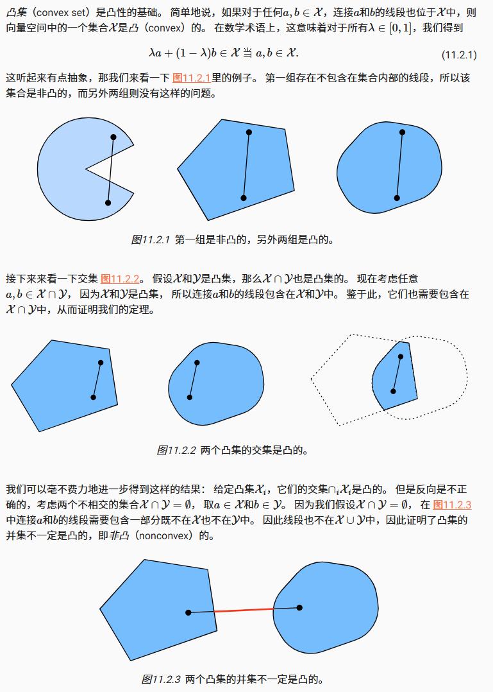
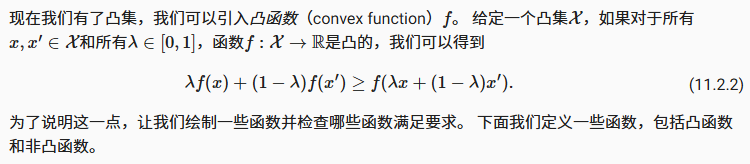
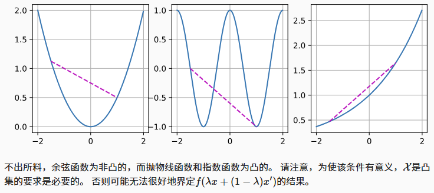
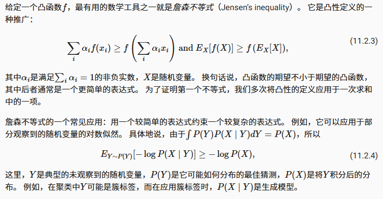
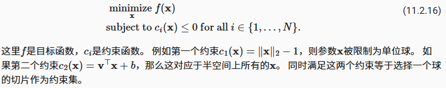
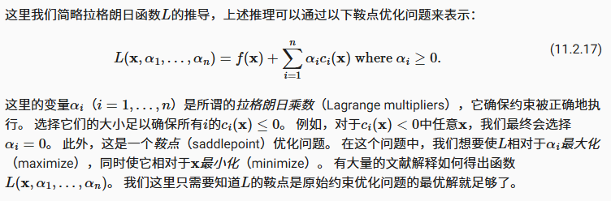

- [凸性](#凸性)
  - [凸函数](#凸函数)
  - [詹森不等式](#詹森不等式)
  - [凸函数的性质](#凸函数的性质)
    - [局部极小值就是全局极小值](#局部极小值就是全局极小值)
    - [凸函数的下水平集是凸的](#凸函数的下水平集是凸的)
    - [凸性和二阶导数](#凸性和二阶导数)
  - [凸函数与约束](#凸函数与约束)
    - [拉格朗日函数](#拉格朗日函数)
    - [惩罚](#惩罚)
    - [投影](#投影)
  - [小结](#小结)

# 凸性

凸集与凸函数




## 凸函数

通过凸集引入凸函数



```python
f = lambda x: 0.5 * x**2  # 凸函数
g = lambda x: torch.cos(np.pi * x)  # 非凸函数
h = lambda x: torch.exp(0.5 * x)  # 凸函数

x, segment = torch.arange(-2, 2, 0.01), torch.tensor([-1.5, 1])
d2l.use_svg_display()
_, axes = d2l.plt.subplots(1, 3, figsize=(9, 3))
for ax, func in zip(axes, [f, g, h]):
    d2l.plot([x, segment], [func(x), func(segment)], axes=ax)
```



## 詹森不等式

凸函数的期望不小于期望的凸函数



## 凸函数的性质

### 局部极小值就是全局极小值

### 凸函数的下水平集是凸的

### 凸性和二阶导数

若这个函数的二阶导数>=0，则这个函数是凸函数，引出

- 若多维函数的`hessian`矩阵>=0，则这个函数是凸函数, `hessian`矩阵的特征值都>=0，是半正定矩阵

## 凸函数与约束

凸优化的一个很好的特性是能够让我们有效地处理约束（constraints），即它使我们能够解决以下形式的约束优化（constrained optimization）问题



### 拉格朗日函数



### 惩罚

- 比如在目标函数中加入权重衰减就是一种惩罚项

### 投影

满足约束条件的另一种策略是投影（projections），凸投影的一个用途是计算稀疏权重向量

## 小结

- 凸集的之间的交集是凸集，并集不是
- 根据詹森不等式，“一个多变量凸函数的总期望值”大于或等于“用每个变量的期望值计算这个函数的总值“
- 一个二次可微函数是凸函数，当且仅当其Hessian（二阶导数矩阵）是半正定的
- 凸约束可以通过拉格朗日函数来添加。在实践中，只需在目标函数中加上一个惩罚就可以了
- 投影映射到凸集中最接近原始点的点
