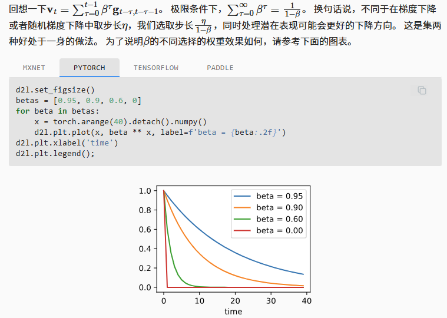
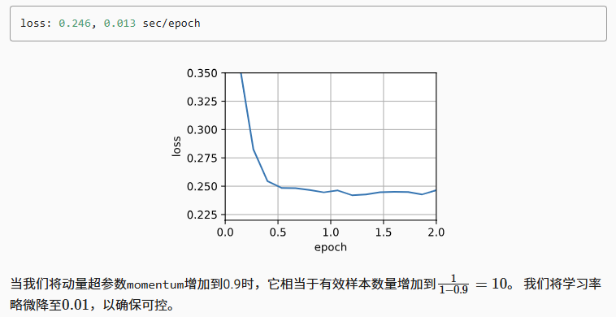
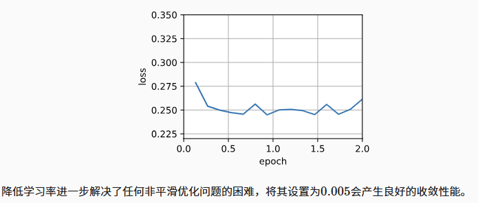
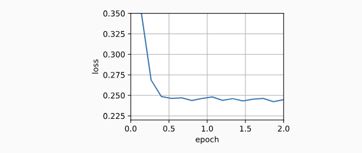

## 动量法

在随机梯度下降的基础上寻找更有效的优化算法

### 泄露平均值

小批量随机梯度下降可以通过以下方式计算


较大的$\Beta$相当于长期平均值，较小的$\Beta$相对于梯度只是略有修正，新的梯度替换不在指向下降最快的方向，而是指向过去梯度的加权平均值的方向。

### 条件不佳的问题

```python
%matplotlib inline
import torch
from d2l import torch as d2l

eta = 0.4
def f_2d(x1, x2):
    return 0.1 * x1 ** 2 + 2 * x2 ** 2
def gd_2d(x1, x2, s1, s2):
    return (x1 - eta * 0.2 * x1, x2 - eta * 4 * x2, 0, 0)

d2l.show_trace_2d(f_2d, d2l.train_2d(gd_2d))
```

若选择较小的学习率，能保证在x2方向不会发散，但要承受在x1方向收敛缓慢；若学习率0.6，x1收敛变快，x2则发散

```python
eta = 0.6
d2l.show_trace_2d(f_2d, d2l.train_2d(gd_2d))
```

### 动量法

观察上面的优化轨迹，我们可能会直觉到计算过去的平均梯度效果会很好，x1方向比较集中，在x2的梯度震荡方向可以相互抵消

```python
def momentum_2d(x1, x2, v1, v2):
    v1 = beta * v1 + 0.2 * x1
    v2 = beta * v2 + 4 * x2
    return x1 - eta * v1, x2 - eta * v2, v1, v2

eta, beta = 0.6, 0.5
d2l.show_trace_2d(f_2d, d2l.train_2d(momentum_2d))
```

正如所见，尽管学习率与我们以前使用的相同，动量法仍然很好地收敛了.当降低动量参数时$\beta = 0.25$会导致一条几乎没有收敛的轨迹。 尽管如此，它比没有动量时解将会发散要好得多

```python
eta, beta = 0.6, 0.25
d2l.show_trace_2d(f_2d, d2l.train_2d(momentum_2d))
```

### 有效样本权重



### 从零实现动量法

相比于小批量随机梯度下降，动量方法需要维护一组辅助变量，即速度

```python
def init_momentum_states(feature_dim):
    v_w = torch.zeros((feature_dim, 1))
    v_b = torch.zeros(1)
    return (v_w, v_b)

def sgd_momentum(params, states, hyperparams):
    for p, v in zip(params, states):
        with torch.no_grad():
            v[:] = hyperparams['momentum'] * v + p.grad
            p[:] -= hyperparams['lr'] * v
        p.grad.data.zero_()
```

```python
def train_momentum(lr, momentum, num_epochs=2):
    d2l.train_ch11(sgd_momentum, init_momentum_states(feature_dim),
                   {'lr': lr, 'momentum': momentum}, data_iter,
                   feature_dim, num_epochs)

data_iter, feature_dim = d2l.get_data_ch11(batch_size=10)
train_momentum(0.02, 0.5)
```



```python
train_momentum(0.01, 0.9)
```



```python
train_momentum(0.005, 0.9)
```



### 简洁实现

```python
trainer = torch.optim.SGD
d2l.train_concise_ch11(trainer, {'lr': 0.005, 'momentum': 0.9}, data_iter)
```

## 小结

- 动量法用过去梯度的平均值来替换梯度
- 对于无噪声梯度下降和嘈杂随机梯度下降，动量法都是可取的
- 动量法可以防止在随机梯度下降的优化过程停滞的问题
- 由于对过去的数据进行了指数降权，有效梯度数为$1/(1-\beta)$
- 动量法的实现非常简单，但它需要我们存储额外的状态向量
