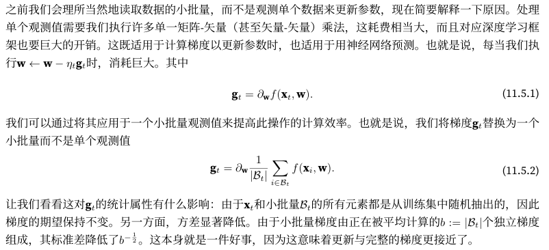

# 小批量随机梯度下降 minibatch stochastic gradient descent



 在实践中我们选择一个足够大的小批量，它可以提供良好的计算效率同时仍适合GPU的内存

在批量归一化`batch normalization`中，我们使用了一种在很大程度上取决于小批量中的方差的正则化。 随着后者增加，方差会减少，随之而来的是批量规范化带来的噪声注入的好处

## 从零开始实现小批量随机梯度下降

添加了一个状态输入states并将超参数放在字典hyperparams中。 此外，我们将**在训练函数里对各个小批量样本的损失求平均，因此优化算法中的梯度不需要除以批量大小**

```python
def sgd(params, states, hyperparams):
    for p in params:
        p.data.sub_(hyperparams['lr'] * p.grad)
        p.grad.data.zero_()
```

下面实现一个通用的训练函数，它初始化了一个线性回归模型，然后可以使用小批量随机梯度下降以及后续小节介绍的其他算法来训练模型

```python
#@save
def train_ch11(trainer_fn, states, hyperparams, data_iter,
               feature_dim, num_epochs=2):
    # 初始化模型
    w = torch.normal(mean=0.0, std=0.01, size=(feature_dim, 1),
                     requires_grad=True)
    b = torch.zeros((1), requires_grad=True)
    net, loss = lambda X: d2l.linreg(X, w, b), d2l.squared_loss
    # 训练模型
    animator = d2l.Animator(xlabel='epoch', ylabel='loss',
                            xlim=[0, num_epochs], ylim=[0.22, 0.35])
    n, timer = 0, d2l.Timer()
    for _ in range(num_epochs):
        for X, y in data_iter:
            l = loss(net(X), y).mean()
            l.backward()
            trainer_fn([w, b], states, hyperparams)
            n += X.shape[0]
            if n % 200 == 0:
                timer.stop()
                animator.add(n/X.shape[0]/len(data_iter),
                             (d2l.evaluate_loss(net, data_iter, loss),))
                timer.start()
    print(f'loss: {animator.Y[0][-1]:.3f}, {timer.avg():.3f} sec/epoch')
    return timer.cumsum(), animator.Y[0]
```

过将小批量设置为1500（即样本总数）来实现。 因此，模型参数每个迭代轮数只迭代一次

```python
def train_sgd(lr, batch_size, num_epochs=2):
    data_iter, feature_dim = get_data_ch11(batch_size)
    return train_ch11(
        sgd, None, {'lr': lr}, data_iter, feature_dim, num_epochs)

gd_res = train_sgd(1, 1500, 10)
```

当批量大小为1时，优化使用的是随机梯度下降。 为了简化实现，我们选择了很小的学习率。 在随机梯度下降的实验中，每当一个样本被处理，模型参数都会更新。 在这个例子中，这相当于每个迭代轮数有1500次更新。 可以看到，目标函数值的下降在1个迭代轮数后就变得较为平缓。 尽管两个例子在一个迭代轮数内都处理了1500个样本，但实验中随机梯度下降的一个迭代轮数耗时更多。 这是因为随机梯度下降更频繁地更新了参数，而且一次处理单个观测值效率较低

```python
sgd_res = train_sgd(0.005, 1)
```

最后，当批量大小等于100时，我们使用小批量随机梯度下降进行优化。 每个迭代轮数所需的时间比随机梯度下降和批量梯度下降所需的时间短

```python
mini1_res = train_sgd(.4, 100)
```

将批量大小减少到10，每个迭代轮数的时间都会增加，因为每批工作负载的执行效率变得更低

```python
mini2_res = train_sgd(.05, 10)
```

对比四个实验的时间与损失，在处理样本数方面，随机梯度下降的收敛速度快于梯度下降，但与梯度下降相比，它需要更多的时间来达到同样的损失，因为逐个样本来计算梯度并不那么有效

小批量随机梯度下降能够平衡收敛速度和计算效率。大小为10的小批量比随机梯度下降更有效；大小为100的小批量在运行时间上甚至优于梯度下降

```python
d2l.set_figsize([6, 3])
d2l.plot(*list(map(list, zip(gd_res, sgd_res, mini1_res, mini2_res))),
         'time (sec)', 'loss', xlim=[1e-2, 10],
         legend=['gd', 'sgd', 'batch size=100', 'batch size=10'])
d2l.plt.gca().set_xscale('log')
```

## 简洁实现

```python
#@save
def train_concise_ch11(trainer_fn, hyperparams, data_iter, num_epochs=4):
    # 初始化模型
    net = nn.Sequential(nn.Linear(5, 1))
    def init_weights(m):
        if type(m) == nn.Linear:
            torch.nn.init.normal_(m.weight, std=0.01)
    net.apply(init_weights)

    optimizer = trainer_fn(net.parameters(), **hyperparams)
    loss = nn.MSELoss(reduction='none')
    animator = d2l.Animator(xlabel='epoch', ylabel='loss',
                            xlim=[0, num_epochs], ylim=[0.22, 0.35])
    n, timer = 0, d2l.Timer()
    for _ in range(num_epochs):
        for X, y in data_iter:
            optimizer.zero_grad()
            out = net(X)
            y = y.reshape(out.shape)
            l = loss(out, y)
            l.mean().backward()
            optimizer.step()
            n += X.shape[0]
            if n % 200 == 0:
                timer.stop()
                # MSELoss计算平方误差时不带系数1/2
                animator.add(n/X.shape[0]/len(data_iter),
                             (d2l.evaluate_loss(net, data_iter, loss) / 2,))
                timer.start()
    print(f'loss: {animator.Y[0][-1]:.3f}, {timer.avg():.3f} sec/epoch')


#
data_iter, _ = get_data_ch11(10)
trainer = torch.optim.SGD
train_concise_ch11(trainer, {'lr': 0.01}, data_iter)
```

## 小结

- 随机梯度下降的“统计效率”与大批量一次处理数据的“计算效率”之间存在权衡。小批量随机梯度下降提供了两全其美的答案：计算和统计效率
- 在小批量随机梯度下降中，我们处理通过训练数据的随机排列获得的批量数据（即每个观测值只处理一次，但按随机顺序）
- 在训练期间降低学习率有助于训练
- 一般来说，小批量随机梯度下降比随机梯度下降和梯度下降的速度快，收敛风险较小
