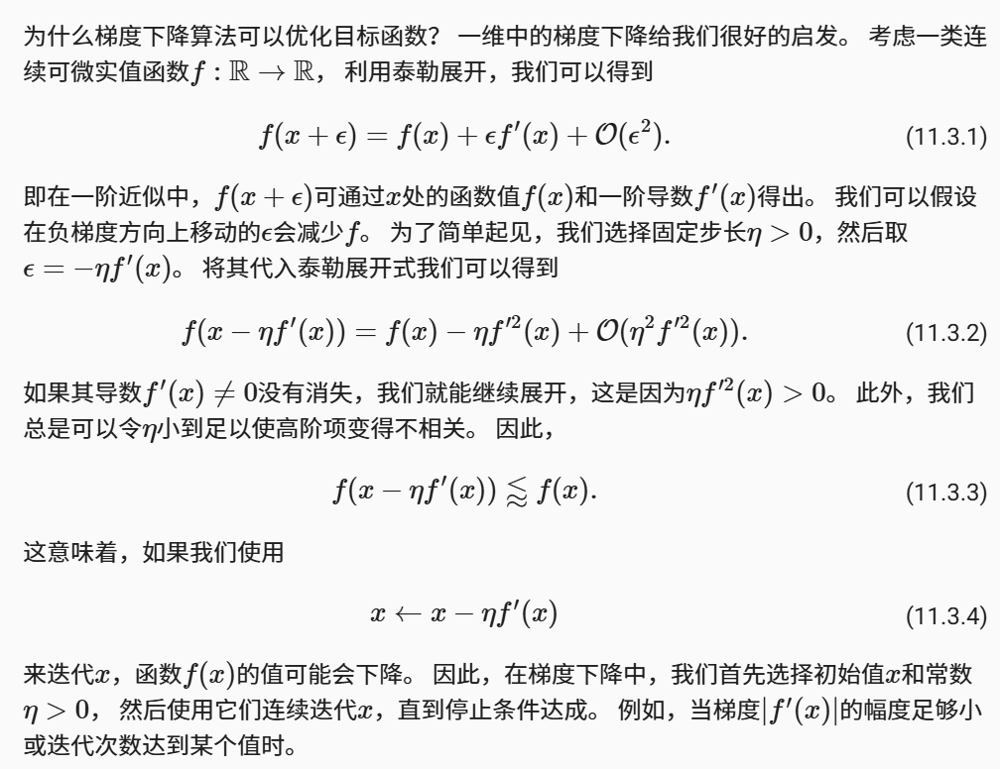
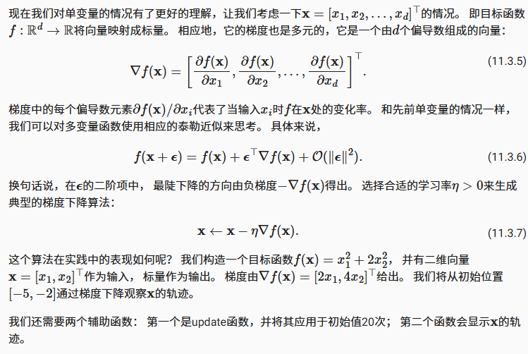
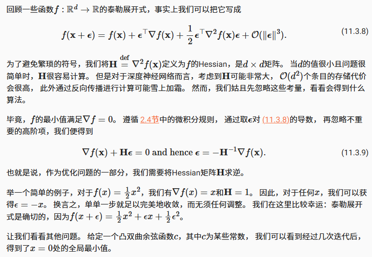
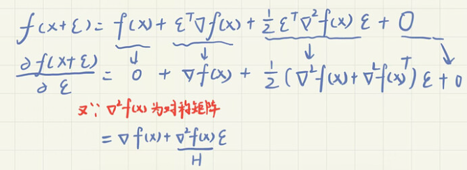
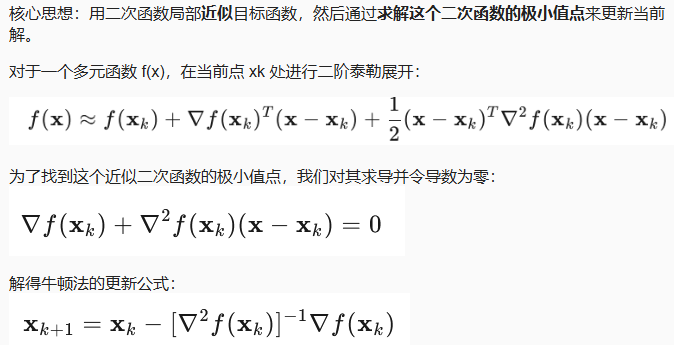
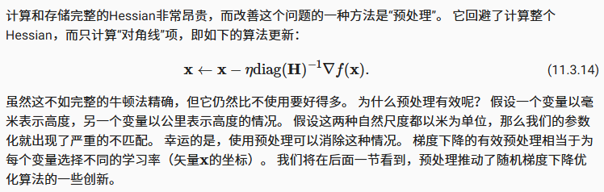

- [梯度下降与预处理](#梯度下降与预处理)
- [一维梯度下降](#一维梯度下降)
  - [学习率](#学习率)
  - [局部最小值](#局部最小值)
- [多元梯度下降](#多元梯度下降)
- [自适应方法](#自适应方法)
  - [牛顿法](#牛顿法)
  - [预处理](#预处理)
  - [梯度下降与线搜索](#梯度下降与线搜索)
- [小结](#小结)

## 梯度下降与预处理

梯度下降很少直接用于DL，但了解它是理解下一节随机梯度下降算法的关键。 例如，由于学习率过大，优化问题可能会发散，这种现象早已在梯度下降中出现。 同样地，预处理（preconditioning）是梯度下降中的一种常用技术， 还被沿用到更高级的算法中

## 一维梯度下降



一维梯度下降简单实现

```python
import numpy as np
import torch
from d2l import torch as d2l

def f(x):  # 目标函数
    return x ** 2

def f_grad(x):  # 目标函数的梯度(导数)
    return 2 * x
```

使用x=10作为初始值，假设$\eta=0.2$,使用梯度下降迭代x10次，可以观察到x的值慢慢接近最优解0

```python
def gd(eta, f_grad):
    '''
    :param eta: 学习率
    :param f_grad: 目标函数的梯度(导数)
    '''
    x = 10.0
    results = [x]
    for i in range(10):
        x -= eta * f_grad(x) # 梯度反向更新
        results.append(float(x))
    print(f'epoch 10, x: {x:f}')
    return results

results = gd(0.2, f_grad)
```

### 学习率

学习率（learning rate）决定目标函数能否收敛到局部最小值，以及何时收敛到最小值。学习率太小会导致收敛变慢，学习率过高过高则可能会导致发散

### 局部最小值

考虑$f(x) = x*cos(cx)$,c是常数，这个函数具有无穷个局部最小值，根据我们选择的学习率，我们最终可能只会得到许多解的一个，下面例子说明了高学习率如何导致较差的局部最小值

```python
c = torch.tensor(0.15 * np.pi)

def f(x):  # 目标函数
    return x * torch.cos(c * x)

def f_grad(x):  # 目标函数的梯度
    return torch.cos(c * x) - c * x * torch.sin(c * x)

show_trace(gd(2, f_grad), f)
```

## 多元梯度下降



```python
def train_2d(trainer, steps=20, f_grad=None):  #@save
    """用定制的训练机优化2D目标函数"""
    # s1和s2是稍后将使用的内部状态变量
    x1, x2, s1, s2 = -5, -2, 0, 0
    results = [(x1, x2)]
    for i in range(steps):
        if f_grad:
            x1, x2, s1, s2 = trainer(x1, x2, s1, s2, f_grad)
        else:
            x1, x2, s1, s2 = trainer(x1, x2, s1, s2)
        results.append((x1, x2))
    print(f'epoch {i + 1}, x1: {float(x1):f}, x2: {float(x2):f}')
    return results

def show_trace_2d(f, results):  #@save
    """显示优化过程中2D变量的轨迹"""
    d2l.set_figsize()
    d2l.plt.plot(*zip(*results), '-o', color='#891bad')
    x1, x2 = torch.meshgrid(torch.arange(-5.5, 1.0, 0.1),
                          torch.arange(-3.0, 1.0, 0.1), indexing='ij')
    d2l.plt.contour(x1, x2, f(x1, x2), colors='#510707ff')
    d2l.plt.xlabel('x1')
    d2l.plt.ylabel('x2')


def f_2d(x1, x2):  # 目标函数
    return x1 ** 2 + 2 * x2 ** 2

def f_2d_grad(x1, x2):  # 目标函数的梯度
    return (2 * x1, 4 * x2)

def gd_2d(x1, x2, s1, s2, f_grad):
    g1, g2 = f_grad(x1, x2)
    return (x1 - eta * g1, x2 - eta * g2, 0, 0)

eta = 0.1 # 学习率0.1
show_trace_2d(f_2d, train_2d(gd_2d, f_grad=f_2d_grad))
```

## 自适应方法

选择适当的学习率是比较复杂的，如果不必考虑学习率，除了考虑目标函数的值和梯度、还考虑它的曲率的二阶方法可以帮我们解决这个问题

虽然由于计算代价的原因，这些方法不能直接应用于深度学习，但它们为如何设计高级优化算法提供了有用的思路

### 牛顿法





对$\epsilon$求导，使导数为0



```python
c = torch.tensor(0.5)

def f(x):  # O目标函数
    return torch.cosh(c * x)

def f_grad(x):  # 目标函数的梯度
    return c * torch.sinh(c * x)

def f_hess(x):  # 目标函数的Hessian
    return c**2 * torch.cosh(c * x)

def newton(eta=1):
    x = 10.0
    results = [x]
    for i in range(10):
        x -= eta * f_grad(x) / f_hess(x)
        results.append(float(x))
        print('epoch results:', results)
    return results

show_trace(newton(), f)
```

现在让我们考虑一个非凸函数,比如$f(x)=x*cos(x)$ c为常数，在牛顿法中需要除以Hessian矩阵，如果二阶导是负数，f的值会趋于增加，这里是个缺陷

```python
c = torch.tensor(0.15 * np.pi)

def f(x):  # 目标函数
    return x * torch.cos(c * x)

def f_grad(x):  # 目标函数的梯度
    return torch.cos(c * x) - c * x * torch.sin(c * x)

def f_hess(x):  # 目标函数的Hessian
    return - 2 * c * torch.sin(c * x) - x * c**2 * torch.cos(c * x)

show_trace(newton(), f)
```

这发生了惊人的错误，一种方法是用取Hessian的绝对值来修正，另一个策略是重新引入学习率。但是拥有二阶信息可以使我们在曲率较大时保持谨慎，而在目标函数较平坦时则采用较大的学习率

### 预处理

计算和存储完整的Hessian非常昂贵，而改善这个问题的一种方法是“预处理”。 它回避了计算整个Hessian，而只计算“对角线”项



### 梯度下降与线搜索

梯度下降的一个关键问题是我们可能会超过目标或进展不足， 解决这一问题的简单方法是结合使用线搜索和梯度下降。也就是说使用梯度给出的方向，再进行二分搜素以确定哪个学习率使得$f(x-\eta \nabla f(x))$取最小值

然而，对深度学习而言，这不太可行。 因为线搜索的每一步都需要评估整个数据集上的目标函数，实现它的方式太昂贵了

## 小结

- 学习率太大会使模型发散，学习率太小会没有进展
- 梯度下降会可能陷入局部极小值，而得不到全局最小值
- 在高维模型中，调整学习率是很复杂的
- 预处理有助于调节比例
- 牛顿法在凸问题中一旦开始正常工作，速度就会快得多
- 对于非凸问题，不要不作任何调整就使用牛顿法
