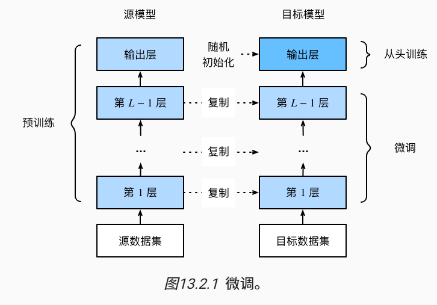

- [图像增广](#图像增广)
- [模型微调 fine-tuning](#模型微调-fine-tuning)
  - [锚框 anchor](#锚框-anchor)
- [语义分割 semantic-segmentation](#语义分割-semantic-segmentation)
- [转置卷积](#转置卷积)
- [图像风格迁移](#图像风格迁移)

可以改进模型泛化的方法：
1. 图像增广
2. 模型微调

# 图像增广

通过翻转、裁剪、对颜色空间，亮度等变量调整使得图像增强，提高模型的泛化性

# 模型微调 fine-tuning
迁移学习（transfer learning）将从源数据集学到的知识迁移到目标数据集

1. 在源数据集（例如ImageNet数据集）上预训练神经网络模型，即源模型
2. 创建一个新的神经网络模型，即目标模型。这将复制源模型上的所有模型设计及其参数（输出层除外）
   1. 我们假定这些模型参数包含从源数据集中学到的知识，这些知识也将适用于目标数据集
   2. 假设源模型的输出层与源数据集的标签密切相关；因此不在目标模型中使用该层
3. 向目标模型添加输出层，其输出数是目标数据集中的类别数。然后随机初始化该层的模型参数
4. 在目标数据集（如椅子数据集）上训练目标模型。输出层将从头开始进行训练，而所有其他层的参数将根据源模型的参数进行微调

当目标数据集比源数据集小得多时，微调有助于提高模型的泛化能力

- 迁移学习将从源数据集中学到的知识迁移到目标数据集，微调是迁移学习的常见技巧
- 除输出层外，目标模型从源模型中复制所有模型设计及其参数，并根据目标数据集对这些参数进行微调。但是，目标模型的输出层需要从头开始训练
- 通常，微调参数使用较小的学习率，而从头开始训练输出层可以使用更大的学习率

## 锚框 anchor

1. 目标检测算法会在每个像素上生成大量锚框，然后为锚框标注类别和偏移量
2. 经典的目标检测网络：R-CNN 区域卷积神经网络, fast R-CNN, Faster R-CNN, YOLO
3. 使用卷积神经网络对每个区域执行前向传播提取特征，然后再用这些特征来预测锚框的类别和偏移量

# 语义分割 semantic-segmentation

将图像分割成不同语义的区域，是像素级别的

与语义分割相似的问题：
1. 图像分割（image segmentation）
  1. 图像分割可能会将狗分为两个区域：一个覆盖以黑色为主的嘴和眼睛，另一个覆盖以黄色为主的其余部分身体
2. 实例分割（instance segmentation）
   1. 也叫同时检测并分割（simultaneous detection and segmentation）实例分割不仅需要区分语义，还要区分不同的目标实例。例如，如果图像中有两条狗，则实例分割需要区分像素属于的两条狗中的哪一条

# 转置卷积

用于实现上采样的目的

怎么把转置卷积变成正常卷积：

# 图像风格迁移

1. 内容损失使合成图像与内容图像在内容特征上接近；
2. 风格损失使合成图像与风格图像在风格特征上接近；
3. 全变分损失则有助于减少合成图像中的噪点。

最后，当模型训练结束时，我们输出风格迁移的模型参数，即得到最终的合成图像
