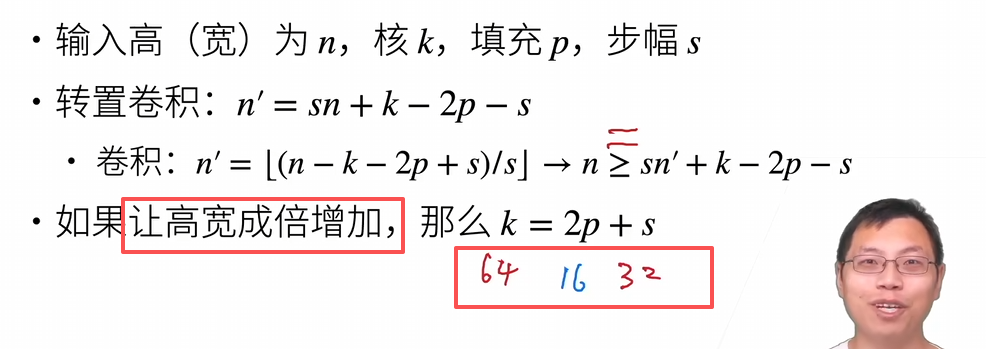

- [语义分割 semantic-segmentation](#语义分割-semantic-segmentation)
- [转置卷积](#转置卷积)
- [图像风格迁移](#图像风格迁移)

可以改进模型泛化的方法：
1. 图像增广
2. 模型微调

## 锚框 anchor

1. 目标检测算法会在每个像素上生成大量锚框，然后为锚框标注类别和偏移量
2. 经典的目标检测网络：R-CNN 区域卷积神经网络, fast R-CNN, Faster R-CNN, YOLO
3. 使用卷积神经网络对每个区域执行前向传播提取特征，然后再用这些特征来预测锚框的类别和偏移量

# 语义分割 semantic-segmentation

将图像分割成不同语义的区域，是像素级别的

与语义分割相似的问题：
1. 图像分割（image segmentation）
  1. 图像分割可能会将狗分为两个区域：一个覆盖以黑色为主的嘴和眼睛，另一个覆盖以黄色为主的其余部分身体
2. 实例分割（instance segmentation）
   1. 也叫同时检测并分割（simultaneous detection and segmentation）实例分割不仅需要区分语义，还要区分不同的目标实例。例如，如果图像中有两条狗，则实例分割需要区分像素属于的两条狗中的哪一条

# 转置卷积

用于实现上采样的目的

怎么把转置卷积变成正常卷积：

# 图像风格迁移

1. 内容损失使合成图像与内容图像在内容特征上接近；
2. 风格损失使合成图像与风格图像在风格特征上接近；
3. 全变分损失则有助于减少合成图像中的噪点。

最后，当模型训练结束时，我们输出风格迁移的模型参数，即得到最终的合成图像
