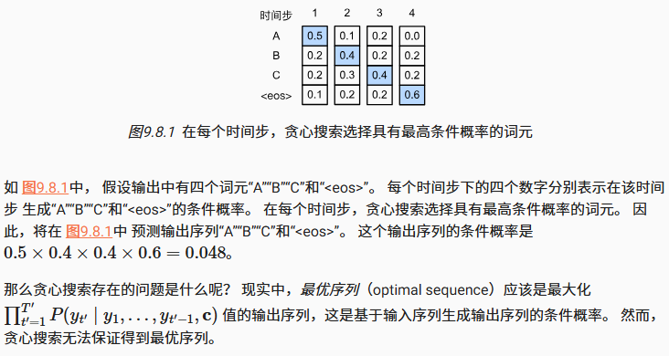
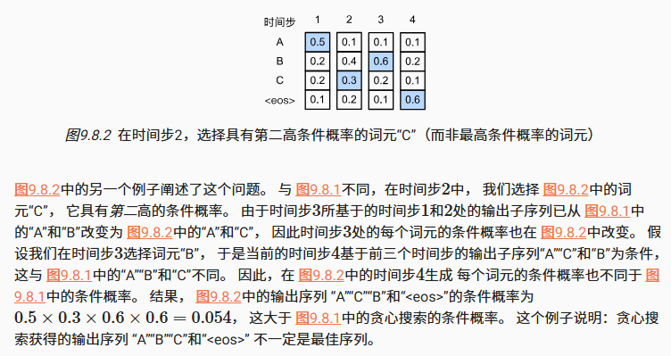
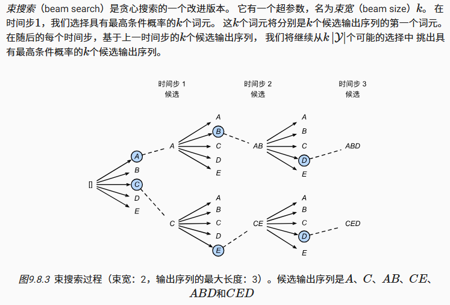

1. 序列搜索策略包括贪心搜索、穷举搜索和束搜索
2. 贪心搜索所选取序列的计算量最小，但精度相对较低
3. 穷举搜索所选取序列的精度最高，但计算量最大
4. 束搜索通过灵活选择束宽，在正确率和计算代价之间进行权衡

## 贪心搜索

贪心搜索获得的输出序列不一定是最佳序列

## 穷举搜索

如果目标是获得最优序列， 我们可以考虑使用穷举搜索（exhaustive search）： 穷举地列举所有可能的输出序列及其条件概率， 然后计算输出条件概率最高的一个

但是穷举搜索的计算量可能会非常大

## 束搜索

如果精度最重要，则显然是穷举搜索。 如果计算成本最重要，则显然是贪心搜索。 而束搜索的实际应用则介于这两个极端之间

束搜索的计算量在贪心与穷举搜索之间，通过灵活地选择束宽，束搜索可以在正确率和计算代价之间进行权衡
