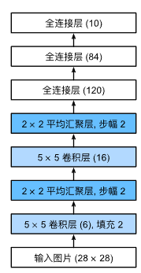
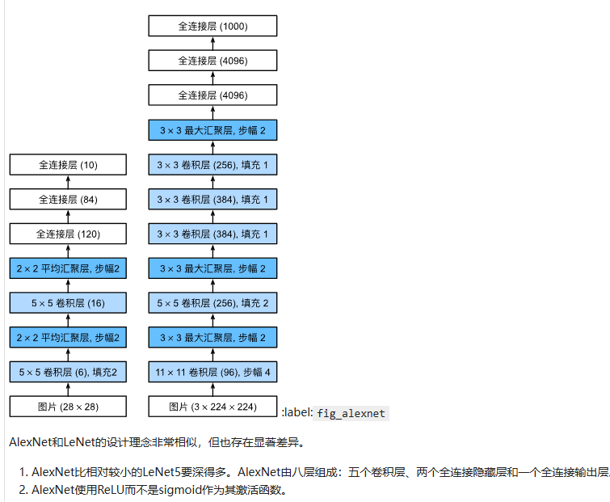
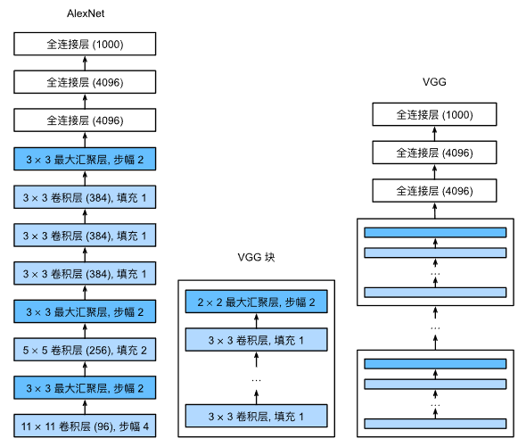
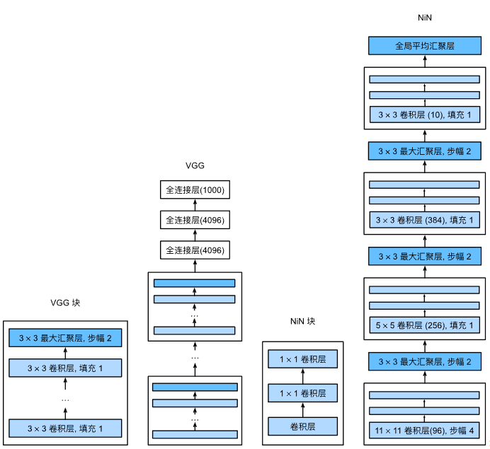
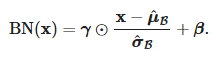
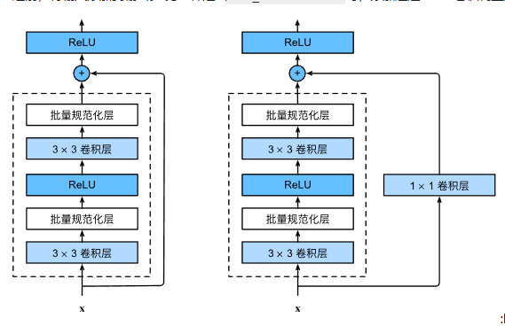
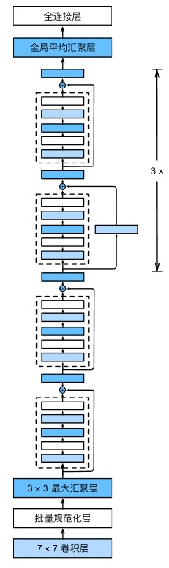

- [线性回归](#线性回归)
  - [softmax](#softmax)
- [MLP](#mlp)
- [CNN](#cnn)
- [现代CNN](#现代cnn)
  - [AlexNet](#alexnet)
  - [VGG](#vgg)
  - [NIN 网络中的网络](#nin-网络中的网络)
  - [batch norm 批量规范化](#batch-norm-批量规范化)
  - [ResNet 残差网络](#resnet-残差网络)
- [一般的现代计算机视觉基本应用](#一般的现代计算机视觉基本应用)

# 线性回归

- 定义线性回归模型`torch.matmul(X, w) + b`
- 初始化模型参数
- 生成数据集`y=Xw+b+噪声 w 线性参数 b 偏置项`
- 定义损失函数 均方损失 `(y_hat - y.reshape(y_hat.shape)) ** 2 / 2` 预测-真实
- 优化算法 小批量随机梯度下降SGD(梯度的反方向),需要先对参数进行反向传播，再结合学习率
  - `param -= lr * param.grad / batch_size` 这里的梯度是求和之后的，需要除以batch_size
  - 更新参数时不需要计算梯度
  - 跟新后结束后需要进行梯度清零

在每个迭代周期执行以下步骤，每个迭代周期都会训练所有的训练数据
1. 按照batch_size从数据集中获取小批量数据
2. 使用网络训练，得到输出 `nat`
3. 根据输出与参考值计算损失函数 `loss`, 然后对损失求和，损失最后往往都定义为标量
4. 对求和后的损失进行反向传播，计算损失对于参数的梯度 `backward`
5. 使用小批量随机梯度下降`SGD`更新参数 `param -= lr * param.grad / batch_size`
6. 本次batch_size遍历结束后，对本次迭代周期的参数进行评估
   1. 在每个epoch结束后，使用整个数据集计算当前模型的平均损失，监控训练过程

## softmax

用于多分类问题,损失函数使用交叉熵

```python
def softmax(X):
    X_exp = torch.exp(X)
    partition = X_exp.sum(1, keepdim=True)
    return X_exp / partition  # 这里应用了广播机制
```

# MLP

多层感知机

- Fashion-MNIST中的每个图像由28*28=784灰度像素值组成。 所有图像共分为10个类别
- 忽略像素之间的空间结构， 我们可以将每个图像视为具有784个输入特征 和10个类的简单分类数据集
- 添加了隐藏的全连接层，网络越深，可能会遇到梯度消失和梯度爆炸的问题
- 正则化技术啊：权重衰减`weight_decay`、暂退层 `dropout`
  - 权重衰减：系数*权重的L2范数家在损失中
  - 暂退层：随机丢弃隐藏层中的部分节点，然后放大剩下的节点，使其期望保持不变，比较主流的正则化方法
- 激活函数：`sigmoid`、`ReLU(比较稳定，在更深网络中难以引起梯度消失)`、`tanh`
- 损失函数一般是交叉熵
- K折交叉验证，将数据集分为K个子集，每次从K个子集中选择一个作为验证集，将剩余的K-1个子集组合成一个训练集，然后循环这些切片 k 次，最后损失取循环次数的平均值

1. 当使用pytorch优化器时`torch.optim.SGD、torch.optim.Adam`,使用损失均值求梯度`l.mean().backward()` `updater.step()`
2. 线性回归中使用自定义SGD，使用梯度求和求损失`l.sum().backward()`，在后面使用自定义优化器函数通过除以批次大小来处理归一化`param -= lr * param.grad / batch_size`

延后初始化

1. 定义了网络架构，但没有指定输入维度，这里应用了框架的延后初始化（defers initialization），即直到数据第一次通过模型传递时，框架才会动态地推断出每个层的大小
2. 一旦我们知道输入维数是20，框架可以通过代入值20来识别第一层权重矩阵的形状。 识别出第一层的形状后，框架处理第二层，依此类推，直到所有形状都已知为止。 注意，在这种情况下，只有第一层需要延迟初始化，但是框架仍是按顺序初始化的

# CNN

图像卷积是图像与卷积核做二维互相关计算，并没有把图像平展

```python
def corr2d(X, K):  #@save
    """计算二维互相关运算"""
    h, w = K.shape
    Y = torch.zeros((X.shape[0] - h + 1, X.shape[1] - w + 1))
    for i in range(Y.shape[0]):
        for j in range(Y.shape[1]):
            Y[i, j] = (X[i:i + h, j:j + w] * K).sum()
    return Y

# 卷积层 对输入和卷积核权重进行互相关运算，并在添加标量偏置之后产生输出
class Conv2D(nn.Module):
    def __init__(self, kernel_size):
        super().__init__()
        self.weight = nn.Parameter(torch.rand(kernel_size))
        self.bias = nn.Parameter(torch.zeros(1))

    def forward(self, x):
        return corr2d(x, self.weight) + self.bias
```

- 填充 padding 与步幅 stride (n-k+p+s)/s
- 汇聚层（池化层）pooling: 汇聚层不包含参数, 池运算是确定性的, 会改变输入宽高,但不改变通道数
  - 通常计算汇聚窗口中所有元素的最大值或平均值。这些操作分别称为最大汇聚层（maximum pooling）和平均汇聚层（average pooling）
  - 但是不会改变通道数
- 使用`stack`可以对数据进行升维拼接；使用`concat`对数据进行降维拼接
- 1 * 1卷积层：卷积核大小为1*1，通常用于改变通道数，如从3通道变成10通道，当以像素为基础应用时，1 * 1卷积相当于全连接层
- 经典的卷积神经网络LeNet
  - 卷积层->平均汇聚层->卷积层->平均汇聚层->全连接层->全连接层->全连接层

```python
net = nn.Sequential(
    nn.Conv2d(1, 6, kernel_size=5, padding=2), nn.Sigmoid(),
    nn.AvgPool2d(kernel_size=2, stride=2),
    nn.Conv2d(6, 16, kernel_size=5), nn.Sigmoid(),
    nn.AvgPool2d(kernel_size=2, stride=2),
    nn.Flatten(),
    nn.Linear(16 * 5 * 5, 120), nn.Sigmoid(),
    nn.Linear(120, 84), nn.Sigmoid(),
    nn.Linear(84, 10))
```



# 现代CNN

## AlexNet

```python
net = nn.Sequential(
    # 这里使用一个11*11的更大窗口来捕捉对象。
    # 同时，步幅为4，以减少输出的高度和宽度。
    # 另外，输出通道的数目远大于LeNet
    nn.Conv2d(1, 96, kernel_size=11, stride=4, padding=1), nn.ReLU(),
    nn.MaxPool2d(kernel_size=3, stride=2),
    # 减小卷积窗口，使用填充为2来使得输入与输出的高和宽一致，且增大输出通道数
    nn.Conv2d(96, 256, kernel_size=5, padding=2), nn.ReLU(),
    nn.MaxPool2d(kernel_size=3, stride=2),
    # 使用三个连续的卷积层和较小的卷积窗口。
    # 除了最后的卷积层，输出通道的数量进一步增加。
    # 在前两个卷积层之后，汇聚层不用于减少输入的高度和宽度
    nn.Conv2d(256, 384, kernel_size=3, padding=1), nn.ReLU(),
    nn.Conv2d(384, 384, kernel_size=3, padding=1), nn.ReLU(),
    nn.Conv2d(384, 256, kernel_size=3, padding=1), nn.ReLU(),
    nn.MaxPool2d(kernel_size=3, stride=2),
    nn.Flatten(),
    # 这里，全连接层的输出数量是LeNet中的好几倍。使用dropout层来减轻过拟合
    nn.Linear(6400, 4096), nn.ReLU(),
    nn.Dropout(p=0.5),
    nn.Linear(4096, 4096), nn.ReLU(),
    nn.Dropout(p=0.5),
    # 最后是输出层。由于这里使用Fashion-MNIST，所以用类别数为10，而非论文中的1000
    nn.Linear(4096, 10))
```



## VGG

深层且窄的卷积比较浅层且宽的卷积更有效



```python
def vgg_block(num_convs, in_channels, out_channels):
    layers = []
    for _ in range(num_convs):
        layers.append(nn.Conv2d(in_channels, out_channels,
                                kernel_size=3, padding=1))
        layers.append(nn.ReLU())
        in_channels = out_channels
    layers.append(nn.MaxPool2d(kernel_size=2,stride=2))
    return nn.Sequential(*layers)


# vgg-11
conv_arch = ((1, 64), (1, 128), (2, 256), (2, 512), (2, 512))

def vgg(conv_arch):
    conv_blks = []
    in_channels = 1
    # 卷积层部分
    for (num_convs, out_channels) in conv_arch:
        conv_blks.append(vgg_block(num_convs, in_channels, out_channels))
        in_channels = out_channels

    return nn.Sequential(
        *conv_blks, nn.Flatten(),
        # 全连接层部分
        nn.Linear(out_channels * 7 * 7, 4096), nn.ReLU(), nn.Dropout(0.5),
        nn.Linear(4096, 4096), nn.ReLU(), nn.Dropout(0.5),
        nn.Linear(4096, 10))

net = vgg(conv_arch)
```

## NIN 网络中的网络

1. nin由一个卷积与多个和1*1卷积层组成块，以允许更多的每像素非线性
2. NiN去除了容易造成过拟合的全连接层，将它们替换为全局平均汇聚层（即在所有位置上进行求和）。该汇聚层通道数量为所需的输出数量
3. 移除全连接层可减少过拟合，同时显著减少NiN的参数



```python
def nin_block(in_channels, out_channels, kernel_size, strides, padding):
    return nn.Sequential(
        nn.Conv2d(in_channels, out_channels, kernel_size, strides, padding),
        nn.ReLU(),
        nn.Conv2d(out_channels, out_channels, kernel_size=1), nn.ReLU(),
        nn.Conv2d(out_channels, out_channels, kernel_size=1), nn.ReLU())


net = nn.Sequential(
    nin_block(1, 96, kernel_size=11, strides=4, padding=0),
    nn.MaxPool2d(3, stride=2),
    nin_block(96, 256, kernel_size=5, strides=1, padding=2),
    nn.MaxPool2d(3, stride=2),
    nin_block(256, 384, kernel_size=3, strides=1, padding=1),
    nn.MaxPool2d(3, stride=2),
    nn.Dropout(0.5),
    # 标签类别数是10
    nin_block(384, 10, kernel_size=3, strides=1, padding=1),
    nn.AdaptiveAvgPool2d((1, 1)),
    # 将四维的输出转成二维的输出，其形状为(批量大小,10)
    nn.Flatten())
```


## batch norm 批量规范化



批量规范化层置于全连接层中的仿射变换和激活函数之间


1. 批量规范化利用小批量的均值和标准差，不断调整神经网络的中间输出，使整个神经网络各层的中间输出值更加稳定
2. 批量规范化在全连接层和卷积层的使用略有不同
3. 批量规范化层和暂退层一样，在训练模式和预测模式下计算不同
4. 批量规范化有许多有益的副作用，主要是正则化

```python
def batch_norm(X, gamma, beta, moving_mean, moving_var, eps, momentum):
    # 通过is_grad_enabled来判断当前模式是训练模式还是预测模式
    if not torch.is_grad_enabled():
        # 如果是在预测模式下，直接使用传入的移动平均所得的均值和方差
        X_hat = (X - moving_mean) / torch.sqrt(moving_var + eps)
    else:
        assert len(X.shape) in (2, 4)
        if len(X.shape) == 2:
            # 使用全连接层的情况，计算特征维上的均值和方差
            mean = X.mean(dim=0)
            var = ((X - mean) ** 2).mean(dim=0)
        else:
            # 使用二维卷积层的情况，计算通道维上（axis=1）的均值和方差。
            # 这里我们需要保持X的形状以便后面可以做广播运算
            mean = X.mean(dim=(0, 2, 3), keepdim=True)
            var = ((X - mean) ** 2).mean(dim=(0, 2, 3), keepdim=True)
        # 训练模式下，用当前的均值和方差做标准化
        X_hat = (X - mean) / torch.sqrt(var + eps)
        # 更新移动平均的均值和方差
        moving_mean = momentum * moving_mean + (1.0 - momentum) * mean
        moving_var = momentum * moving_var + (1.0 - momentum) * var
    Y = gamma * X_hat + beta  # 缩放和移位
    return Y, moving_mean.data, moving_var.data


class BatchNorm(nn.Module):
    # num_features：完全连接层的输出数量或卷积层的输出通道数。
    # num_dims：2表示完全连接层，4表示卷积层
    def __init__(self, num_features, num_dims):
        super().__init__()
        if num_dims == 2:
            shape = (1, num_features)
        else:
            shape = (1, num_features, 1, 1)
        # 参与求梯度和迭代的拉伸和偏移参数，分别初始化成1和0
        self.gamma = nn.Parameter(torch.ones(shape))
        self.beta = nn.Parameter(torch.zeros(shape))
        # 非模型参数的变量初始化为0和1
        self.moving_mean = torch.zeros(shape)
        self.moving_var = torch.ones(shape)

    def forward(self, X):
        # 如果X不在内存上，将moving_mean和moving_var
        # 复制到X所在显存上
        if self.moving_mean.device != X.device:
            self.moving_mean = self.moving_mean.to(X.device)
            self.moving_var = self.moving_var.to(X.device)
        # 保存更新过的moving_mean和moving_var
        Y, self.moving_mean, self.moving_var = batch_norm(
            X, self.gamma, self.beta, self.moving_mean,
            self.moving_var, eps=1e-5, momentum=0.9)
        return Y

# BN nn.BatchNorm2d
net = nn.Sequential(
    nn.Conv2d(1, 6, kernel_size=5), nn.BatchNorm2d(6), nn.Sigmoid(),
    nn.AvgPool2d(kernel_size=2, stride=2),
    nn.Conv2d(6, 16, kernel_size=5), nn.BatchNorm2d(16), nn.Sigmoid(),
    nn.AvgPool2d(kernel_size=2, stride=2), nn.Flatten(),
    nn.Linear(256, 120), nn.BatchNorm1d(120), nn.Sigmoid(),
    nn.Linear(120, 84), nn.BatchNorm1d(84), nn.Sigmoid(),
    nn.Linear(84, 10))
```


## ResNet 残差网络



- 残差块与批量规范化使网络深度可以加到100以上

```python
class Residual(nn.Module):  #@save
    def __init__(self, input_channels, num_channels,
                 use_1x1conv=False, strides=1):
        super().__init__()
        self.conv1 = nn.Conv2d(input_channels, num_channels,
                               kernel_size=3, padding=1, stride=strides)
        self.conv2 = nn.Conv2d(num_channels, num_channels,
                               kernel_size=3, padding=1)
        if use_1x1conv:
            self.conv3 = nn.Conv2d(input_channels, num_channels,
                                   kernel_size=1, stride=strides)
        else:
            self.conv3 = None
        self.bn1 = nn.BatchNorm2d(num_channels)
        self.bn2 = nn.BatchNorm2d(num_channels)

    def forward(self, X):
        Y = F.relu(self.bn1(self.conv1(X)))
        Y = self.bn2(self.conv2(Y))
        if self.conv3:
            X = self.conv3(X)
        Y += X
        return F.relu(Y)
```



# 一般的现代计算机视觉基本应用

[一般的现代计算机视觉基本应用](../ch13_computer_vision/computer_vision.md)
